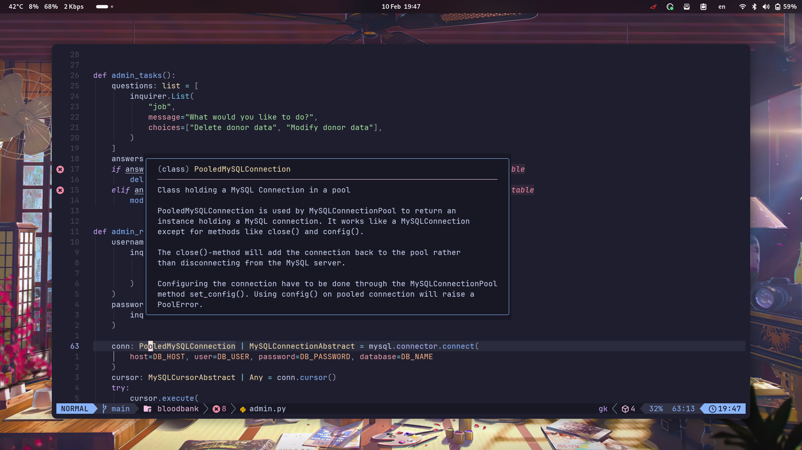
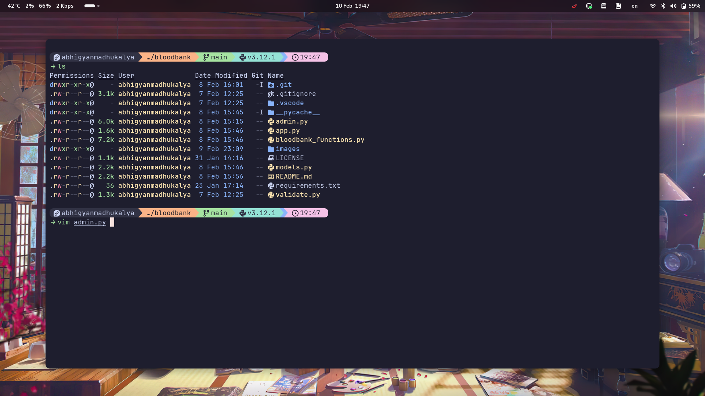
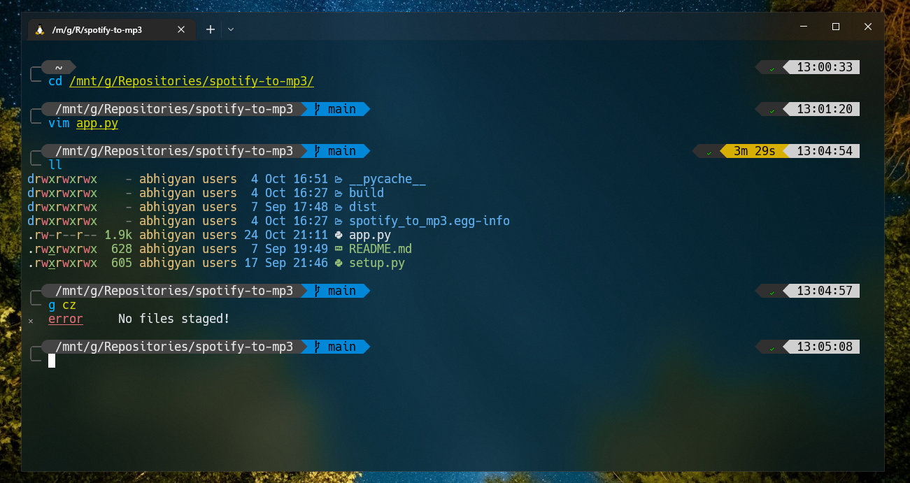

# Abhigyan's dotfiles

> [!NOTE]
> Don’t blindly use my settings unless you know what that entails. Use at your own risk.

**I use EndeavourOS (I don't really want to go through the hassle of installing Arch) as my OS.**

> This repo is managed using GNU Stow. Install it using your package manager to make symlinks to the files without actually coping any of them.

## Contents

- [Neovim](#neovim)
- [Git](https://github.com/abhigyanmadhukalya/dotfiles/blob/master/.gitconfig)
- [Tmux](https://github.com/abhigyanmadhukalya/dotfiles/blob/master/.config/tmux)
- [Zsh Shell](#zsh-shell)
- [Fish Shell](#fish-shell)
- [PowerShell](#powershell)

## Neovim

I currently use [LazyVim](https://lazyvim.org) as a base for my Neovim config and followed a guide from [@craftzdog](https://github.com/craftzdog) to make it more personalised for me,

## Zsh Shell

I have switched from Fish to Zsh as it is POSIX compliant and I never run into
any issues while dealing with shell scripts. All the features that were present
in Fish have been ported to Zsh using community plugins.

## Fish Shell

The config remains same as my old one, nothing's changed since I don't use Fish
anymore and have switched to Zsh.

- [Fish shell](https://fishshell.com/)
- [Fisher](https://github.com/jorgebucaran/fisher) - Plugin manager
- [Tide](https://github.com/IlanCosman/tide) - Shell theme. Use version 5:
  `fisher install ilancosman/tide@v5`
- [Nerd fonts](https://github.com/ryanoasis/nerd-fonts) - Powerline-patched
  fonts. I use Hack.
- [z for fish](https://github.com/jethrokuan/z) - Directory jumping
- [nvm for fish](https://github.com/jorgebucaran/nvm.fish) - Locally manage
  multiple versions of NodeJS

## PowerShell

The PowerShell config has also not changed at all. It works well enough for the
rare cases I need to use it.

- [Scoop](https://scoop.sh/) - A command-line installer
- [Git for Windows](https://gitforwindows.org/)
- [Oh My Posh](https://ohmyposh.dev/) - Prompt theme engine
- [Terminal Icons](https://github.com/devblackops/Terminal-Icons) - Folder and
  file icons
- [PSReadLine](https://docs.microsoft.com/en-us/powershell/module/psreadline/) -
  Cmdlets for customizing the editing environment, used for autocompletion
- [z](https://www.powershellgallery.com/packages/z) - Directory jumper
- [PSFzf](https://github.com/kelleyma49/PSFzf) - Fuzzy finder
